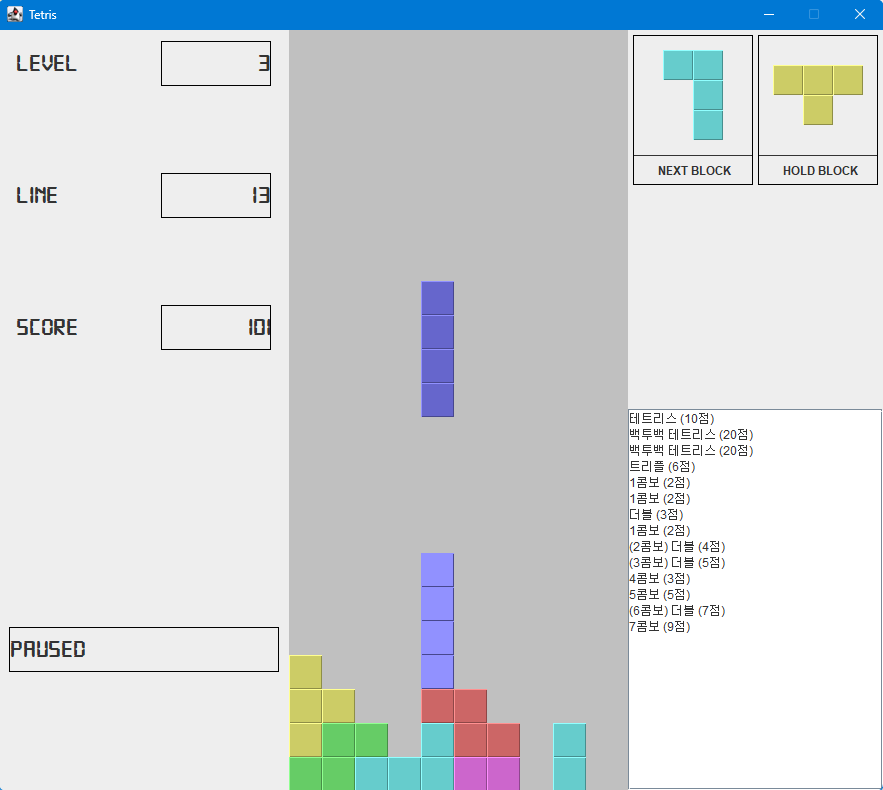

# Java-Tetris-Game
Java Tetris game clone source code. Uses Java 12.  
https://zetcode.com/javagames/tetris/

# 자바 테트리스 게임 수정사항
1. Level, Deleted Line, Score 기능 추가
2. StatusBar 기능 추가
3. Next Block 기능 추가
4. Hold Block 기능 추가
5. Score Log 추가
6. Ghost Block 기능 추가
7. Combo, BackToBack, T-spin Double 판정 기능 추가
8. Block 생성 규칙(7-Bag) 적용
9. 시작 시 대기 시간 적용
10. Bgm, Sfx 추가

## 차후 수정 가능한 사항
1. Ranking 기능 추가
2. Item 기능 추가
3. Block 회전 기능 보강 (벽이나 블록에 인접해서 회전 시 회전 가능한 곳으로 블록 위치 조정하여 회전하는 기능)

